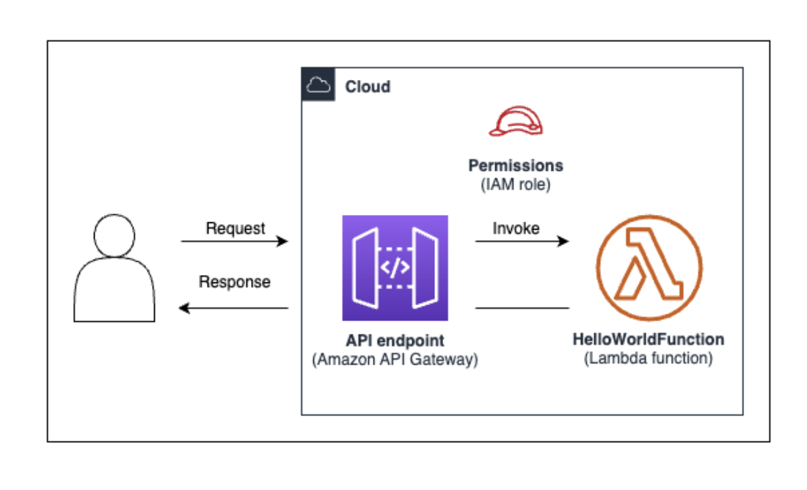
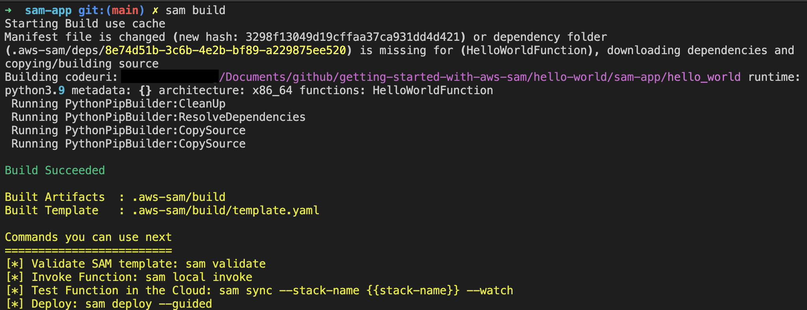

# getting-started-with-aws-sam

This is a repo used to get started with AWS SAM.

[Sam Command reference](https://docs.aws.amazon.com/serverless-application-model/latest/developerguide/serverless-sam-cli-command-reference.html)

Prereqs:

- An [AWS account](https://repost.aws/knowledge-center/create-and-activate-aws-account), AWS Identity and Access Management [(IAM) credentials](https://docs.aws.amazon.com/streams/latest/dev/setting-up.html), and an [IAM access key pair](https://docs.aws.amazon.com/IAM/latest/UserGuide/id_credentials_access-keys.html).
- The [AWS Command Line Interface (AWS CLI)](https://docs.aws.amazon.com/cli/latest/userguide/getting-started-install.html) to configure AWS credentials.
- Install [AWS Serverless Application Model (SAM)](https://docs.aws.amazon.com/serverless-application-model/latest/developerguide/install-sam-cli.html)

## Task-1: First SAM app - Hello World



In this task we will deploy a simple SAM app in in the hello-world/:

- Step 1: Initialize the sample Hello World application
- Step 2: Build your application
- Step 3: Deploy your application to the AWS Cloud
- Step 4: Run your application
- Step 5: Interact with your function in the AWS Cloud
- Step 6: Modify and sync your application to the AWS Cloud
- Step 7: (Optional) Test your application locally
- Step 8: Delete your application from the AWS Cloud
- Troubleshooting

Here are the resources used:

- Amazon API Gateway – API endpoint that you will use to invoke your function.
- AWS Lambda – Function that processes the HTTP API GET request and returns a hello world message.
- AWS Identity and Access Management (IAM) role – Provisions permissions for the services to securely interact.

### Step-1 Initialize your SAM application

This step downloads the template for your application with all dependencies.

1. CD into the hello-world/

```bash
cd hello-world/
```

2. Initialize the application:

```bash
sam init
```

3. Select:

- `Choice`: 1 - AWS Quick Start Templates
- `Template`: 1 - Hello World Example
- `Use the most popular runtime and package type? (Python and zip) [y/N]`: y
- `Would you like to enable X-Ray tracing on the function(s) in your application?  [y/N]`: N
- `Would you like to enable monitoring using CloudWatch Application Insights?`: N
- `Would you like to set Structured Logging in JSON format on your Lambda functions?  [y/N]`: N
- `Project name [sam-app]`: ENTER

This downloads the started sample app in the hello-world/

4. CD into the `sam-app` directory.

```bash
cd sam-app
```

5. To view the files that were downloaded:

```bash
tree
```

Here is how your directory is structured:

```bash
➜  sam-app git:(main) ✗ tree
.
├── README.md
├── __init__.py
├── events
│   └── event.json
├── hello_world
│   ├── __init__.py
│   ├── app.py
│   └── requirements.txt
├── samconfig.toml
├── template.yaml
└── tests
    ├── __init__.py
    ├── integration
    │   ├── __init__.py
    │   └── test_api_gateway.py
    ├── requirements.txt
    └── unit
        ├── __init__.py
        └── test_handler.py

6 directories, 14 files
```

To understand the directory structure:

- `hello_world/app.py` – Contains your Lambda function code.
- `hello_world/requirements.txt` – Contains any Python dependencies that your Lambda function requires.
- `samconfig.toml` – Configuration file for your application that stores default parameters used by the AWS SAM CLI.
- `template.yaml` – The AWS SAM template that contains your application infrastructure code.

### Step-2: Build your app

This step builds and prepares your application for deployment.

The `sam build` command in the AWS Serverless Application Model (SAM) CLI is used to build your serverless application and prepare it for deployment. It performs several tasks to get your application ready for deployment, including:

- Code Transformation: The sam build command transforms your Lambda function code to make it compatible with the AWS Lambda execution environment. This includes handling dependencies, compiling code (if necessary), and packaging the code into a deployment artifact (e.g., a ZIP file).

- Dependency Management: If your Lambda functions have external dependencies (e.g., Python packages or Node.js modules), the sam build command will install and package those dependencies along with your function code. This ensures that your Lambda functions have access to all the required dependencies when executed in the AWS Lambda environment.

- Artifact Generation: After transforming and packaging your Lambda function code, the sam build command generates deployment artifacts. These artifacts typically include:

  - A ZIP file containing your Lambda function code and dependencies.
  - A modified version of your SAM template (template.yaml or template.json) with references to the generated deployment artifacts.

- Local Testing: The sam build command can also be used to generate artifacts for local testing of your serverless application. This allows you to test your Lambda functions locally before deploying them to AWS.

The generated deployment artifacts and modified SAM template are then used by the sam deploy command to deploy your serverless application to AWS.

1. Build your app. 

```bash
sam build
```



> NOTE: You have the option to build your app in a container with: `sam build --use-container`

Notice some of the commands that you can use next.

2. View the list of directory and files that were created:

```bash
➜  sam-app git:(main) ✗ tree -aL 3
├── .aws-sam
│   ├── build
│   │   ├── HelloWorldFunction
│   │   └── template.yaml
│   ├── build.toml
│   ├── cache
│   └── deps
│       └── 8e74d51b-3c6b-4e2b-bf89-a229875ee520
```

Here are some of the files that were created:

- `build/HelloWorldFunction`: Contains your Lambda function code and dependencies. The AWS SAM CLI creates a directory for each function in your application.
- `build/template.yaml`: Contains a copy of your AWS SAM template (hello-world/sam-app/template.yaml) that is referenced by AWS CloudFormation at deployment.
- `build.toml`: Configuration file that stores default parameter values referenced by the AWS SAM CLI when building and deploying your application.

### Step-3: Deploy you app

This is a guided sam deployment that will:
- Guide you through configuring your application settings for deployment.
- Upload your application files to Amazon Simple Storage Service (Amazon S3).
- Transform your AWS SAM template into an AWS CloudFormation template and then uploads your template to the AWS CloudFormation service to provision your AWS resources.

1. Start the guided deployment:

```bash
sam deploy --guided
```

2. Enter:

- Stack Name: `hello-world-sam`
- AWS Region: ENTER
- Confirm changes before deploy [Y/n]: `n`
- Allow SAM CLI IAM role creation [Y/n]: `Y`
- Disable rollback [y/N]: `y`
- HelloWorldFunction has no authentication. Is this okay? [y/N]: `y`
- Save arguments to configuration file [Y/n]: `Y`
- SAM configuration file [samconfig.toml]: ENTER
- SAM configuration environment [default]: ENTER

During deployment SAM does these things:

- The AWS SAM CLI creates an Amazon S3 bucket and uploads your .aws-sam directory.
- The AWS SAM CLI transforms your AWS SAM template into AWS CloudFormation and uploads it to the AWS CloudFormation service.
- AWS CloudFormation provisions your resources.
- SAM displays the status of the deployment.

### Step-4: Run your application

Once SAM deploys your app it will provide the URL for your API. At that point you can test your API. 

1. Copy the URL Value for your API. 

```bash
CloudFormation outputs from deployed stack
-----------------------------------------------------------------------------------------------------------------------
Outputs                                                                                                               
-----------------------------------------------------------------------------------------------------------------------
Key                 HelloWorldFunctionIamRole                                                                         
Description         Implicit IAM Role created for Hello World function                                                
Value               arn:aws:iam::012345678910:role/hello-world-sam-HelloWorldFunctionRole-PUamFyQ71cgI                

Key                 HelloWorldApi                                                                                     
Description         API Gateway endpoint URL for Prod stage for Hello World function                                  
Value               https://jtpmb154ca.execute-api.us-east-1.amazonaws.com/Prod/hello/                                

Key                 HelloWorldFunction                                                                                
Description         Hello World Lambda Function ARN                                                                   
Value               arn:aws:lambda:us-east-1:012345678910:function:hello-world-sam-HelloWorldFunction   
-----------------------------------------------------------------------------------------------------------------------


Successfully created/updated stack - hello-world-sam in us-east-1
```

2. Open a new terminal window to curl the endpoint:

```bash
curl https://<restapiid>.execute-api.us-west-2.amazonaws.com/Prod/hello/
```

3. You can also list your endpoints with:

```bash
sam list endpoints --output json
```

### Step-5: Interact with your function in the AWS Cloud

In this step, you use the AWS SAM CLI to invoke your Lambda function in the AWS Cloud.

1. In the terminal invoke your function:

```bash
sam remote invoke HelloWorldFunction --stack-name hello-world-sam
```

Result:
```bash
Invoking Lambda Function HelloWorldFunction                                                                               
START RequestId: 1d770d30-3bc0-4294-a296-22b98533f416 Version: $LATEST
END RequestId: 1d770d30-3bc0-4294-a296-22b98533f416
REPORT RequestId: 1d770d30-3bc0-4294-a296-22b98533f416  Duration: 17.49 ms      Billed Duration: 18 ms  Memory Size: 128 MB       Max Memory Used: 30 MB
{"statusCode": 200, "body": "{\"message\": \"hello world\"}"}% 
```

### Step-6: Modify and sync your application to the AWS Cloud

In this step, you use the AWS SAM CLI sam sync --watch command to sync local changes to the AWS Cloud.

1. In your command line, from the sam-app project directory, run the following:

```bash
sam sync --watch
```

>NOTE: This performs a deployment and then monitors for changes. Once its done you will have to go and make changes. 

2. Open sam-app/hello_world/app.py and make changes to the function:

```python
import json
...
def lambda_handler(event, context):
    ...
    return {
        "statusCode": 200,
        "body": json.dumps({
            "message": "hello everyone!",
            ...
        }),
    }
```

>NOTE: SAM detects the changes and syncs them to the AWS Cloud.

3. Open a new terminal and curl the API:

```bash
curl https://o1e58udbpk.execute-api.us-east-1.amazonaws.com/Prod/hello/
```

Notice the change. 

### Step-7: Testing lambda locally

In this section we use local invoke to test lambda

1. Ensure docker desktop is running. This will spin your function up into a docker container.

2. Navigate to hello-world/sam-app

3. Run the function in a container

```bash
sam local invoke
```

4. To start your API in a local docker container

```bash
sam local start-api
```

### Step-8: Remove your application

1. Open the terminal 

2. To remove the app from AWS

```bash
sam delete
```

3. Enter

- Are you sure you want to delete the stack hello-world-sam in the region us-east-1 ? [y/N]: `y`
- Are you sure you want to delete the folder hello-world-sam in S3 which contains the artifacts? [y/N]: `y`